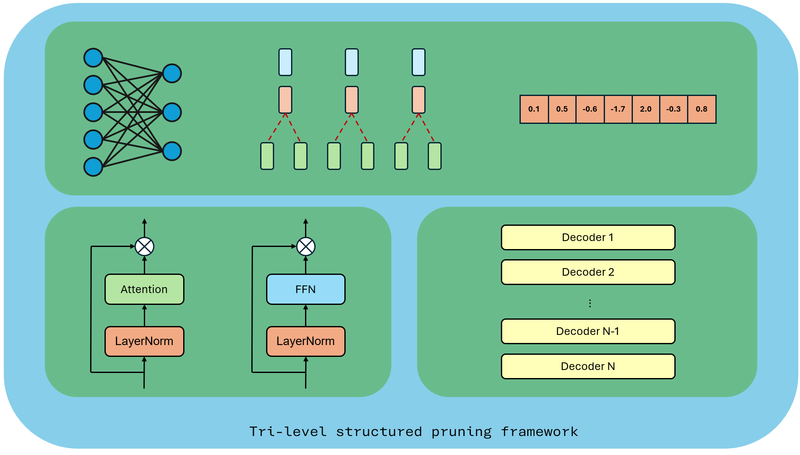
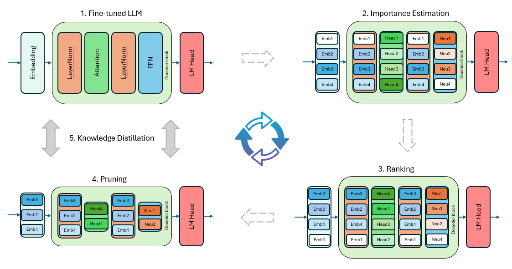
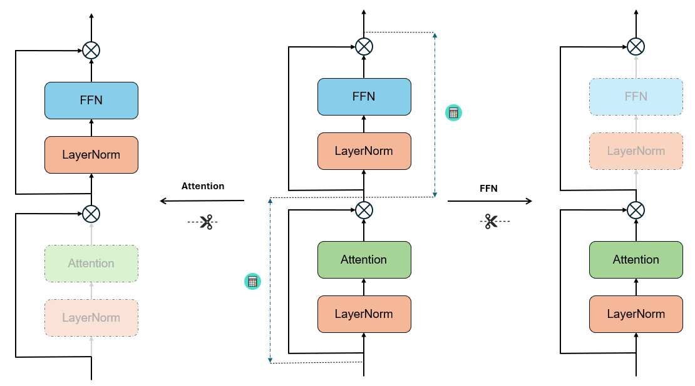
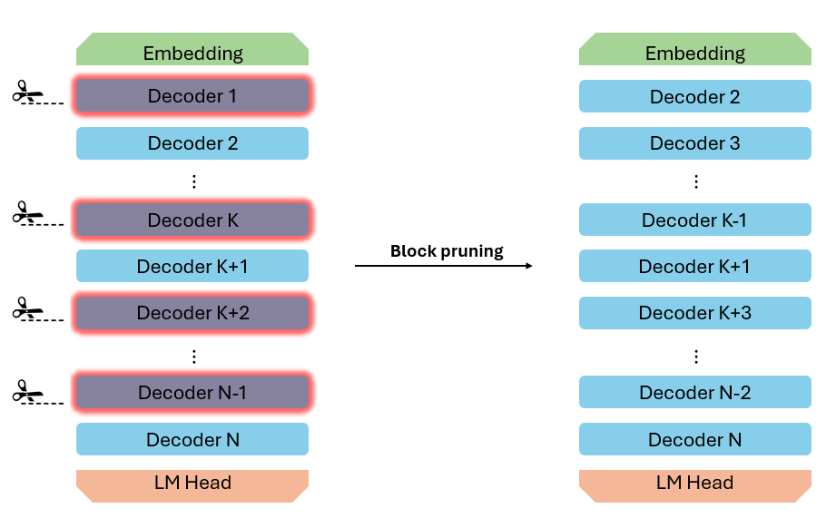

# SOICT-LLM-Pruner

A tri-level framework for structured pruning of Large Language Models (LLMs). Currently supports Llama3 and Qwen2 models.



## Installation

```bash
git clone https://github.com/fannam/SoICT-LLM-Pruner.git
```

Move to SoICT-LLM-Pruner folder

```bash
pip install -e .
```

## Features

- **Element-level Pruning**: Prune individual attention heads, attention groups, MLP neurons and embedding channels
- **Layer-level Pruning**: Remove entire attention or MLP (Feed forward) layers
- **Block-level Pruning**: Remove Decoder blocks
- Support for Llama3 and Qwen2 models
- Multiple importance estimation methods

### Element-level Pruning


### Layer-level Pruning


### Block-level Pruning


## Quick Start

### 1. Import Required Modules

```python
from transformers import AutoModelForCausalLM, AutoTokenizer
from estimator.element_estimator import Llama3ActivationElementEstimator
from estimator.layer_estimator import Llama3SimilarityLayerEstimator
from estimator.block_estimator import Llama3SimilarityBlockEstimator
```

### 2. Load Model and Prepare Data

```python
# Load model and tokenizer
model = AutoModelForCausalLM.from_pretrained("meta-llama/Llama-3.2-1b")
tokenizer = AutoTokenizer.from_pretrained("meta-llama/Llama-3.2-1b")

# Prepare your calibration dataset
# The dataset should be a list of texts or a DataLoader
```

### 3. Estimate Component Importance
On the old version, we passed the dataloader when we initialize the pruner, which is kind of stupid when we want to experiment with many calibration dataset

#### Element-level Importance (Attention Heads and MLP Neurons)

```python
# Initialize estimator
element_estimator = Llama3ActivationElementEstimator(model)

# Estimate attention head importance
head_importance = element_estimator.estimate_attention_heads(dataloader, agg="l2")

# Estimate MLP neuron importance
neuron_importance = element_estimator.estimate_mlp_neurons(dataloader, agg="l2")

# Estimate embedding channel importance
embedding_importance = element_estimator.estimate_embedding_channels(dataloader, agg="l2")
```


#### Layer-level Importance

```python
# Initialize estimator
layer_estimator = Llama3SimilarityLayerEstimator(model)

# Estimate importance of attention and MLP layers
layer_importance = layer_estimator.estimate(dataloader)
# Returns: {'attention': [imp0, imp1, ...], 'mlp': [imp0, imp1, ...]}
```

#### Block-level Importance

```python
# Initialize estimator with desired contiguous block size
block_estimator = Llama3SimilarityBlockEstimator(model, block_size=1)

# Estimate importance of contiguous blocks
block_importance = block_estimator.estimate(dataloader)
# Returns: [imp0, imp1, ...] for each possible block start position
```

### Custom Aggregation Methods

The element-level estimator supports different aggregation methods:
- "sum": Sum of activations
- "mean": Mean of activations
- "l2": L2 norm of activations
- "var": Variance of activations

```python
# Example with different aggregation
head_importance = element_estimator.estimate_attention_heads(dataloader, agg="var")
```

### Pruning Based on Importance Scores

After obtaining importance scores, you can use them to prune the model:

```python
from pruner.elemet_level_pruner.ElementPruner import Llama3ElementPruner
from pruner.layer_level_pruner.LayerPruner import Llama3LayerPruner
from pruner.block_level_pruner.BlockPruner import Llama3BlockPruner

element_pruner = Llma3ElementPruner(model, 'cuda')

pruned_model = element_pruner.prune_attention_group(head_importance=head_importance, target_group=7)

```

### Recovery pruned model performance via Knowledge Distillation

```python
from distiller.hybrid_distiller import HybridDistiller

# Use Language Modeling Loss, Logits Loss and Feature-based Loss (Black-box and White-box distillation)
distiller = HybridDistiller(teacher_model, student_model, tokenizer, optimizer, scheduler)
history = distiller.distill(train_loader, val_loader, "cuda", "cuda")
```

```python
from distiller.logits_distiller import LogitsDistiller

# Use only Language Modeling Loss and Logits Loss (full Black-box distillation)\
distiller = HybridDistiller(teacher_model, student_model, tokenizer, optimizer, scheduler)
history = distiller.distill(train_loader, val_loader, "cuda", "cuda")
```

## Supported Models

- Llama3
- Qwen2 

## Requirements

- Python >= 3.8
- PyTorch >= 2.0.0
- Transformers >= 4.30.0
- tqdm >= 4.65.0
- datasets >= 2.14.0
- numpy >= 1.24.0
- accelerate >= 0.4.10

## Citation

