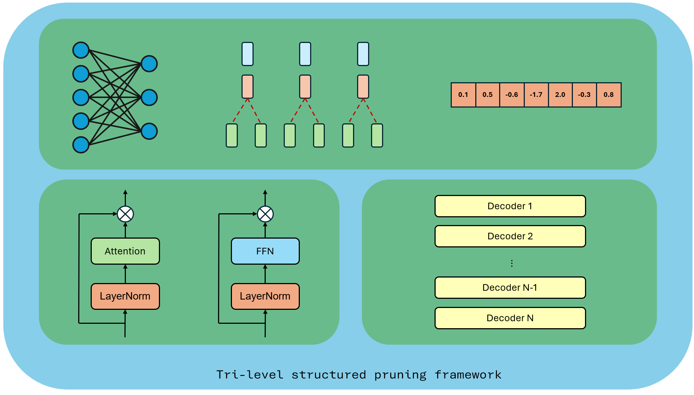
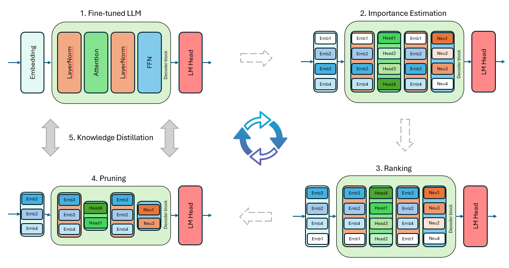
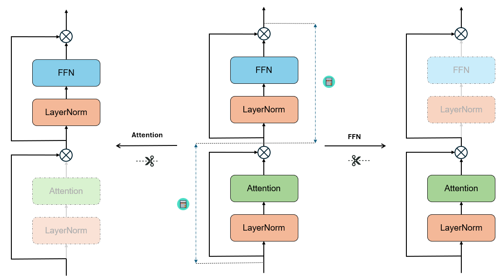
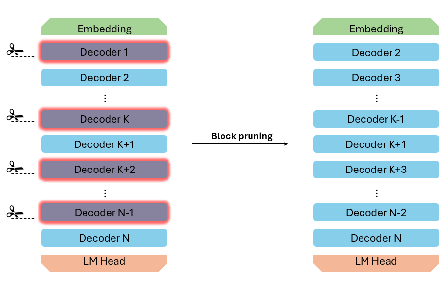
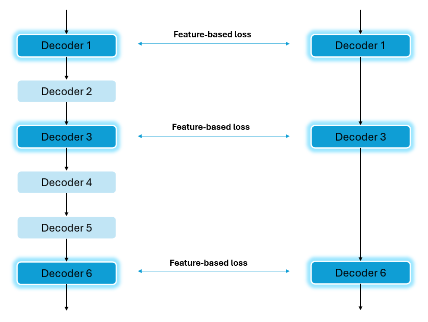

# SOICT-LLM-Pruner

A tri-level framework for structured pruning of Large Language Models (LLMs). The current release ships with separate Llama3, Qwen2, and Mistral adapters, and the codebase is organized around registries plus explicit model-adapter contracts so new estimators, model families, and pruning methods can be plugged in without forcing every model into the same internal layout.



## Installation

```bash
git clone https://github.com/fannam/SoICT-LLM-Pruner.git
```

Then move to SoICT-LLM-Pruner folder

```bash
pip install -e .
```

## Features

- **Element-level Pruning**: Prune individual attention heads, attention groups, MLP neurons and embedding channels
- **Layer-level Pruning**: Remove entire attention or MLP (Feed forward) layers
- **Block-level Pruning**: Remove Decoder blocks
- Support for Llama3, Qwen2, and Mistral models
- Multiple importance estimation methods
- Explicit per-model adapter architecture, with an optional shared helper only for decoder stacks that truly share the same layout
- Registry-based extension points for new estimators and pruning strategies

### Element-level Pruning


### Layer-level Pruning


### Block-level Pruning


## Quick Start

### 1. Import Required Modules

```python
from transformers import AutoModelForCausalLM, AutoTokenizer
from estimator import create_estimator
from pruner import create_pruner
```

### 2. Load Model and Prepare Data

```python
# Load model and tokenizer
from transformers import AutoModelForCausalLM, AutoTokenizer

model = AutoModelForCausalLM.from_pretrained("meta-llama/Llama-3.2-1b")
tokenizer = AutoTokenizer.from_pretrained("meta-llama/Llama-3.2-1b")

# Prepare your calibration dataset
# The dataset should be a DataLoader
```

### 3. Estimate Component Importance
On the old version, we passed the dataloader when we initialize the pruner, which is kind of stupid when we want to experiment with many calibration dataset

#### Element-level Importance (Attention Heads and MLP Neurons)

```python
# Initialize estimator
element_estimator = create_estimator("element.activation", model, device="cuda")

# Estimate attention head importance
head_importance = element_estimator.estimate_attention_heads(dataloader, agg="l2")

# Estimate MLP neuron importance
neuron_importance = element_estimator.estimate_mlp_neurons(dataloader, agg="l2")

# Estimate embedding channel importance
embedding_importance = element_estimator.estimate_embedding_channels(dataloader, agg="l2")
```


#### Layer-level Importance

```python
# Initialize estimator
layer_estimator = create_estimator("layer.similarity", model, device="cuda")

# Estimate importance of attention and MLP layers
layer_importance = layer_estimator.estimate(dataloader)
# Returns: {'attention': [imp0, imp1, ...], 'mlp': [imp0, imp1, ...]}
```

#### Block-level Importance

```python
# Initialize estimator with desired contiguous block size
block_estimator = create_estimator("block.similarity", model, block_size=1, device="cuda")

# Estimate importance of contiguous blocks
block_importance = block_estimator.estimate(dataloader)
# Returns: [imp0, imp1, ...] for each possible block start position
```

### Custom Aggregation Methods

The element-level estimator supports different aggregation methods:
- "sum": Sum of activations
- "mean": Mean of activations
- "l2": L2 norm of activations
- "var": Variance of activations

```python
# Example with different aggregation
head_importance = element_estimator.estimate_attention_heads(dataloader, agg="var")
```

### Pruning Based on Importance Scores

After obtaining importance scores, you can use them to prune the model:

```python
element_pruner = create_pruner("element", model, device="cuda")
pruned_model = element_pruner.apply(
    "attention_group",
    head_importance=head_importance,
    target_group=7,
)

```

Legacy classes such as `Llama3ActivationElementEstimator`, `Qwen2SimilarityLayerEstimator`, `MistralSimilarityBlockEstimator`, or `Llama3ElementPruner` are still available as backward-compatible wrappers.

### Extending the Framework

The refactor introduces three extension points:

1. **New model family**: implement a `BaseModelAdapter` for that family. The built-in Llama3, Qwen2, and Mistral adapters are intentionally kept as separate concrete implementations. If a new model really follows the same decoder layout, it may reuse `DecoderModelAdapter` as a helper base.
2. **New importance estimator**: register a new estimator class in `ESTIMATOR_REGISTRY`.
3. **New pruning method**: register a new strategy in `PRUNING_STRATEGY_REGISTRY`.

Example: register a new decoder-only model that follows the same `model.model.layers[*].self_attn/mlp` layout:

```python
from soict_llm_pruner_core import DecoderModelAdapter, register_model_adapter

register_model_adapter(
    DecoderModelAdapter(
        name="my-decoder-model",
        model_cls=MyDecoderModelForCausalLM,
    )
)
```

Example: if a new family uses a different layout, implement a dedicated adapter instead of forcing it through the shared decoder helper:

```python
from soict_llm_pruner_core import BaseModelAdapter, register_model_adapter


class MyMoEAdapter(BaseModelAdapter):
    def get_layers(self, model):
        return model.transformer.blocks

    def get_embed_tokens(self, model):
        return model.transformer.token_embeddings

    def get_lm_head(self, model):
        return model.output_projection

    # Implement the remaining adapter methods for this architecture.


register_model_adapter(MyMoEAdapter(name="my-moe", model_cls=MyMoEForCausalLM))
```

Example: add a new pruning strategy, such as expert pruning for MoE models:

```python
from pruner.element_level_pruner import BaseElementPruningStrategy
from soict_llm_pruner_core import PRUNING_STRATEGY_REGISTRY


@PRUNING_STRATEGY_REGISTRY.register("element.expert")
class ExpertPruningStrategy(BaseElementPruningStrategy):
    def prune(self, pruner, expert_importance, target_num_experts):
        # Implement expert selection and weight transfer here.
        raise NotImplementedError
```

You can inspect the available built-in components at runtime:

```python
from estimator import available_estimators
from pruner import available_element_pruning_strategies, available_pruners

print(available_estimators())
print(available_pruners())
print(available_element_pruning_strategies())
```

For more examples, please visit `Notebook/Demo_library.ipynb` or `Notebook/Demo_gradio.ipynb`.

### Recovery pruned model performance via Knowledge Distillation

```python
from distiller.hybrid_distiller import HybridDistiller

# Use Language Modeling Loss, Logits Loss and Feature-based Loss (Black-box and White-box distillation)
distiller = HybridDistiller(teacher_model, student_model, tokenizer, optimizer, scheduler)
history = distiller.distill(train_loader, val_loader, "cuda", "cuda")
```

```python
from distiller.logits_distiller import LogitsDistiller

# Use only Language Modeling Loss and Logits Loss (full Black-box distillation)\
distiller = LogitsDistiller(teacher_model, student_model, tokenizer, optimizer, scheduler)
history = distiller.distill(train_loader, val_loader, "cuda", "cuda")
```

### Hybrid Distillation Approach

Our hybrid distillation approach addresses the challenge of depth mismatch between teacher and student models through a combination of black-box and white-box distillation techniques:

1. **Black-box Distillation**:
   - Language Modeling Loss: Standard cross-entropy loss for next token prediction
   - Logits Distillation: KL divergence between teacher and student logits with temperature scaling

2. **White-box Distillation**:
   - Feature-based Loss: Projection-based feature matching between corresponding layers
   - Handles depth mismatch by:
     - Identifying kept layers in the pruned student model
     - Using learnable projectors to align feature dimensions
     - Computing MSE loss between projected student features and teacher features



The hybrid approach combines these losses with configurable weights:
- α: Controls balance between cross-entropy and KL divergence
- γ: Controls contribution of feature-based loss
- Temperature: Adjusts softness of logits for better knowledge transfer

## Supported Models

- Llama3
- Qwen2
- Mistral

## Requirements

- Python >= 3.8
- PyTorch >= 2.0.0
- Transformers >= 4.38.2
- tqdm >= 4.65.0
- datasets >= 2.14.0
- numpy >= 1.24.0
- accelerate >= 0.4.10

## Citation
